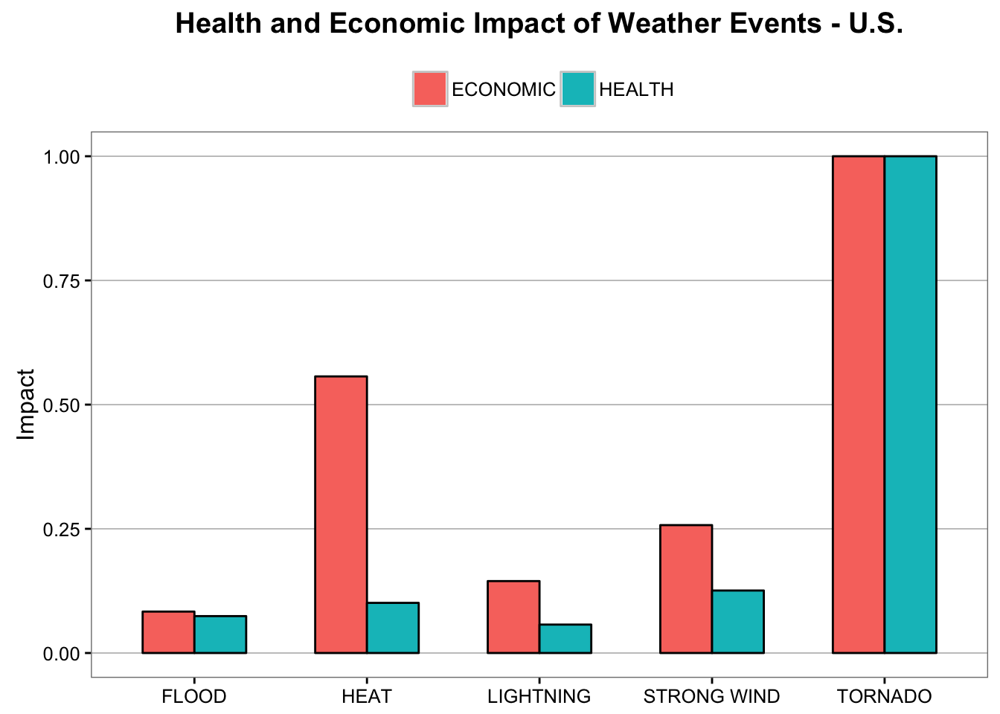
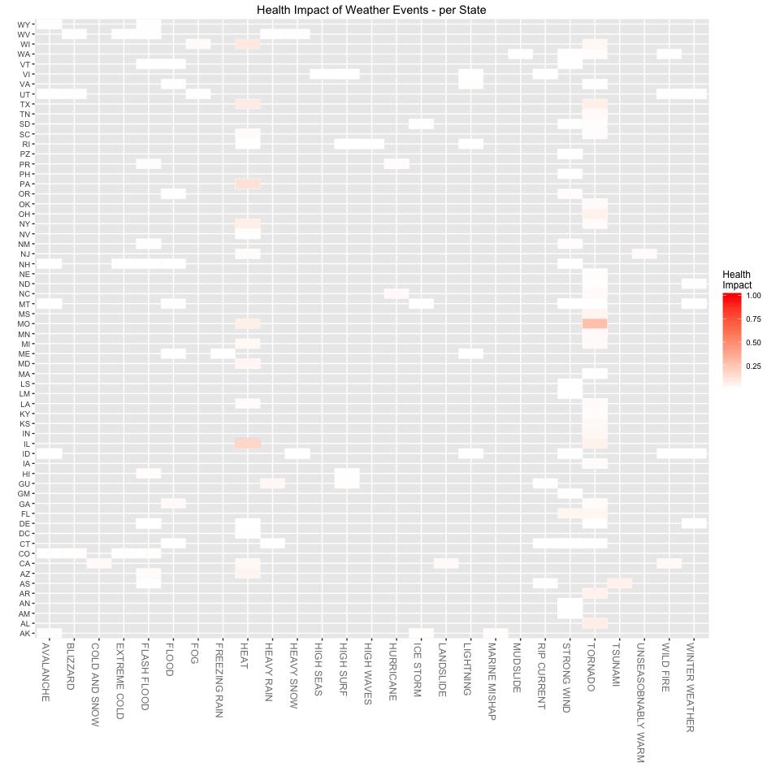
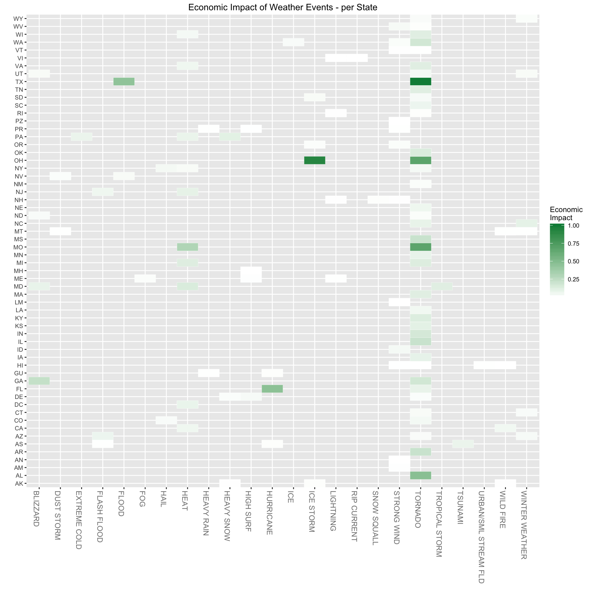

# Health and Economic Impact of Severe Weather Events
J Faleiro  
March 21st, 2016  

### Synopsis

The basic goal of this study is to explore the NOAA Storm Database and answer some basic questions about health and economic impact of severe weather events especifically, across the United States, which types of events:

1. Are most harmful with respect to population health?
2. Have the greatest economic consequences?

Our analysis will be conducted in R and will consist of tables, figures and several summaries. We will take special care to document each of the steps, making sure they follow a fully scripted flow and therefore allow for the entire analysis to be entirely reproducible.

### Data Processing

This section describes and executes the preparation of the data required for our analysis, from dowloading the data, to loading the data into R, to the extraction of samples of the data. Given the size of the data and extensive plots, we will be caching each of the chunks to minimize re-work and speed up processing.

#### Preliminaries

We will start by defining the libraries this analysis depends on. We will define dependencies using `pacman`.


```r
if (!require("pacman")) install.packages("pacman")
pacman::p_load(R.utils, data.table, R.cache, dplyr, tidyr, ggplot2)
```

If dependencies are not in your environment they will be installed and properly loaded.

#### Loading Storm Database

Next, we download the original NOAA storm database to local disk. The location of the remote file is given by the variable `url`.


```r
stormFileName <- 'stormdata.csv.bz2'
url <- 'https://d396qusza40orc.cloudfront.net/repdata%2Fdata%2FStormData.csv.bz2'
download.file(url, stormFileName, method='curl')
```

The file is a comma separated value, compressed.


```r
storm <- read.csv(stormFileName, stringsAsFactors=FALSE)
```

We don't know exactly which columns will be needed for this analysis, so we will proceed with a quick inspection of the storm data to understand which columns we will be needed.


```r
head(storm)
```

```
##   STATE__           BGN_DATE BGN_TIME TIME_ZONE COUNTY COUNTYNAME STATE
## 1       1  4/18/1950 0:00:00     0130       CST     97     MOBILE    AL
## 2       1  4/18/1950 0:00:00     0145       CST      3    BALDWIN    AL
## 3       1  2/20/1951 0:00:00     1600       CST     57    FAYETTE    AL
## 4       1   6/8/1951 0:00:00     0900       CST     89    MADISON    AL
## 5       1 11/15/1951 0:00:00     1500       CST     43    CULLMAN    AL
## 6       1 11/15/1951 0:00:00     2000       CST     77 LAUDERDALE    AL
##    EVTYPE BGN_RANGE BGN_AZI BGN_LOCATI END_DATE END_TIME COUNTY_END
## 1 TORNADO         0                                               0
## 2 TORNADO         0                                               0
## 3 TORNADO         0                                               0
## 4 TORNADO         0                                               0
## 5 TORNADO         0                                               0
## 6 TORNADO         0                                               0
##   COUNTYENDN END_RANGE END_AZI END_LOCATI LENGTH WIDTH F MAG FATALITIES
## 1         NA         0                      14.0   100 3   0          0
## 2         NA         0                       2.0   150 2   0          0
## 3         NA         0                       0.1   123 2   0          0
## 4         NA         0                       0.0   100 2   0          0
## 5         NA         0                       0.0   150 2   0          0
## 6         NA         0                       1.5   177 2   0          0
##   INJURIES PROPDMG PROPDMGEXP CROPDMG CROPDMGEXP WFO STATEOFFIC ZONENAMES
## 1       15    25.0          K       0                                    
## 2        0     2.5          K       0                                    
## 3        2    25.0          K       0                                    
## 4        2     2.5          K       0                                    
## 5        2     2.5          K       0                                    
## 6        6     2.5          K       0                                    
##   LATITUDE LONGITUDE LATITUDE_E LONGITUDE_ REMARKS REFNUM
## 1     3040      8812       3051       8806              1
## 2     3042      8755          0          0              2
## 3     3340      8742          0          0              3
## 4     3458      8626          0          0              4
## 5     3412      8642          0          0              5
## 6     3450      8748          0          0              6
```

As we can see, this is an extensive dataset. We will need just a subset of the original columns to answer the questions posed in the synopis, specifically:

* The type of event `EVTYPE`
* The state `STATE`
* Number of fatalities `FATALITIES`
* Number of injuries `INJURIES`


```r
storm <- storm %>% 
         mutate(EVTYPE=toupper(EVTYPE)) %>%
         select(EVTYPE, STATE, FATALITIES, INJURIES)
summary(storm)
```

```
##     EVTYPE             STATE             FATALITIES      
##  Length:902297      Length:902297      Min.   :  0.0000  
##  Class :character   Class :character   1st Qu.:  0.0000  
##  Mode  :character   Mode  :character   Median :  0.0000  
##                                        Mean   :  0.0168  
##                                        3rd Qu.:  0.0000  
##                                        Max.   :583.0000  
##     INJURIES        
##  Min.   :   0.0000  
##  1st Qu.:   0.0000  
##  Median :   0.0000  
##  Mean   :   0.1557  
##  3rd Qu.:   0.0000  
##  Max.   :1700.0000
```

This analysis will have to be performed at both federal and state level, so we will prepare an aggregate of all fatalitites and injuries across all states. But before that, one last check for absent values:


```r
sum(is.na(storm))
```

```
## [1] 0
```

No absent values.


```r
stormUS <- storm %>% 
           select(EVTYPE, FATALITIES, INJURIES) %>%
           group_by(EVTYPE) %>%
           summarize(FATALITIES=sum(FATALITIES), INJURIES=sum(INJURIES))
summary(stormUS)
```

```
##     EVTYPE            FATALITIES         INJURIES      
##  Length:898         Min.   :   0.00   Min.   :    0.0  
##  Class :character   1st Qu.:   0.00   1st Qu.:    0.0  
##  Mode  :character   Median :   0.00   Median :    0.0  
##                     Mean   :  16.86   Mean   :  156.5  
##                     3rd Qu.:   0.00   3rd Qu.:    0.0  
##                     Max.   :5633.00   Max.   :91346.0
```

#### Adjusting Event Types

Next we will make sure event types, given by column `EVTYPE`, are not misrepresenting events. In other words, we don't have mispelled descriptions. Since we are only concerned with high impact events, we will only check the top events.


```r
sampleSize <- 15
head(arrange(stormUS, desc(FATALITIES)), sampleSize)
```

```
## Source: local data frame [15 x 3]
## 
##               EVTYPE FATALITIES INJURIES
## 1            TORNADO       5633    91346
## 2     EXCESSIVE HEAT       1903     6525
## 3        FLASH FLOOD        978     1777
## 4               HEAT        937     2100
## 5          LIGHTNING        816     5230
## 6          TSTM WIND        504     6957
## 7              FLOOD        470     6789
## 8        RIP CURRENT        368      232
## 9          HIGH WIND        248     1137
## 10         AVALANCHE        224      170
## 11      WINTER STORM        206     1321
## 12      RIP CURRENTS        204      297
## 13         HEAT WAVE        172      379
## 14      EXTREME COLD        162      231
## 15 THUNDERSTORM WIND        133     1488
```

There are several event types described by the different `EVTYPE` values. We will proceed with cleaning up of the more important ones. We will use `dplyr::mutate` and `grepl` to look for similar event types and replace them by a representative alternative:


```r
storm <- storm %>%
         mutate(EVTYPE=ifelse(grepl('.*HEAT', EVTYPE), 'HEAT', 
                       ifelse(grepl('.*WIND', EVTYPE), 'STRONG WIND',
                       ifelse(grepl('.*TORNADO.*', EVTYPE), 'TORNADO',
                       ifelse(grepl('.*HURRICANE.*', EVTYPE), 'HURRICANE',
                       ifelse(grepl('.*SURF.*', EVTYPE), 'HIGH SURF',
                       ifelse(grepl('.*RIP CURRENT.*', EVTYPE), 'RIP CURRENT',
                       ifelse(grepl('.*FLASH FLOOD.*', EVTYPE), 'FLASH FLOOD',
                       ifelse(grepl('.*UNSEASONABLY.*WARM.*', EVTYPE), 'UNSEASOBNABLY WARM',
                       ifelse(grepl('.*UNSEASONABLY.*COLD.*', EVTYPE), 'UNSEASOBNABLY COLD',
                       ifelse(grepl('.*WINTER.*', EVTYPE), 'WINTER WEATHER',
                       ifelse(grepl('.*WILD.*FIRE.*', EVTYPE), 'WILD FIRE',
                              EVTYPE)))))))))))
                )
```


And since we changed several important event types, we will re-do the U.S. aggregation of events and re-sample it:


```r
stormUS <- storm %>% 
           select(EVTYPE, FATALITIES, INJURIES) %>%
           group_by(EVTYPE) %>%
           summarize(FATALITIES=sum(FATALITIES), INJURIES=sum(INJURIES))

head(arrange(stormUS, desc(FATALITIES)), sampleSize)
```

```
## Source: local data frame [15 x 3]
## 
##            EVTYPE FATALITIES INJURIES
## 1         TORNADO       5636    91407
## 2            HEAT       3138     9224
## 3     STRONG WIND       1451    11498
## 4     FLASH FLOOD       1035     1802
## 5       LIGHTNING        816     5230
## 6     RIP CURRENT        572      529
## 7           FLOOD        470     6789
## 8  WINTER WEATHER        277     1876
## 9       AVALANCHE        224      170
## 10      HIGH SURF        163      246
## 11   EXTREME COLD        162      231
## 12      HURRICANE        133     1328
## 13     HEAVY SNOW        127     1021
## 14       BLIZZARD        101      805
## 15     HEAVY RAIN         98      251
```

Now the more important events have a representative and unique event type. Much better.

#### Scaling Quantities

In order to come up with a notion of _impact_ we need quantities of fatalities to be somehow comparable. We wil be scaling them within a minimum and maximum interval so for every quantity $q$ it will be bound to the interval $0 <= q <= 1$. We will use the function `doScaling` for that.


```r
doScaling <- function(items) {
    # scale(items, center=FALSE, scale=max(items)) # does not work properly 
    if (min(items) == max(items)) 1 else (items - min(items)) / (max(items) - min(items))
}
```

For a meaningfull representation of fatalities and injuries, we have to scale them separately:
 

```r
storm$FATALITIES <- doScaling(storm$FATALITIES)
storm$INJURIES <- doScaling(storm$INJURIES)
summary(storm)
```

```
##     EVTYPE             STATE             FATALITIES      
##  Length:902297      Length:902297      Min.   :0.00e+00  
##  Class :character   Class :character   1st Qu.:0.00e+00  
##  Mode  :character   Mode  :character   Median :0.00e+00  
##                                        Mean   :2.88e-05  
##                                        3rd Qu.:0.00e+00  
##                                        Max.   :1.00e+00  
##     INJURIES       
##  Min.   :0.00e+00  
##  1st Qu.:0.00e+00  
##  Median :0.00e+00  
##  Mean   :9.16e-05  
##  3rd Qu.:0.00e+00  
##  Max.   :1.00e+00
```

We have to perform the same scaling on data across U.S. as well, again separately for fatalities and injuries.


```r
stormUS$FATALITIES <- doScaling(stormUS$FATALITIES)
stormUS$INJURIES <- doScaling(stormUS$INJURIES)
summary(stormUS)
```

```
##     EVTYPE            FATALITIES          INJURIES       
##  Length:598         Min.   :0.000000   Min.   :0.000000  
##  Class :character   1st Qu.:0.000000   1st Qu.:0.000000  
##  Mode  :character   Median :0.000000   Median :0.000000  
##                     Mean   :0.004494   Mean   :0.002571  
##                     3rd Qu.:0.000000   3rd Qu.:0.000000  
##                     Max.   :1.000000   Max.   :1.000000
```

#### De-Leveraging

We can see in the summary above the high leverage of values on `FATALITIES` and `INJURIES`. Given the nature of the questions we intend to answer, we care about high leveraged quantities only. We will de-leverage data at U.S. and state levels separately.

##### Removing U.S. Low Leverage Data


```r
top <- 7
topFatalities <- sort(stormUS$FATALITIES, TRUE)[top] # top fatalities
topInjuries <- sort(stormUS$INJURIES, TRUE)[top]     # top injuries
majorStormsUS <- stormUS %>%
                 filter(FATALITIES > 0 & INJURIES > 0) %>%
                 filter(FATALITIES >= topFatalities & INJURIES >= topInjuries)
```

##### Removing State Low Leverage Data


```r
top <- 3
majorStormsInjuries <- storm %>%
                            select(EVTYPE, STATE, INJURIES) %>%
                            filter(INJURIES > 0) %>%
                            group_by(STATE) %>%
                            top_n(n=top, wt=INJURIES)
majorStormsFatalities <- storm %>%
                            select(EVTYPE, STATE, FATALITIES) %>%
                            filter(FATALITIES > 0) %>%
                            group_by(STATE) %>%
                            top_n(n=top, wt=FATALITIES)
```

#### Impact Calculation 

##### Assumptions 

To answer the 2 questions posted on our synopsis, we will first have to differentiate between events that are more harmful to population health and the ones that have the greatest economic consequences. Since not all the data necessary for this analysis is available (like life expectancy for proper calculation of mortality economic cost) we will use a simplification of the [WHO quide to identifying the economic consequences of disease and injury][WHO_guide_economic_impact]:

* Number of injuries will define the economic impact of an event
* Number of fatalities will define the harm impact of an event to population health 

To adequate to this model, we reshape the dataframe to represent economic and health impact, given the following structure:

* The type of event `EVTYPE`
* The state `STATE`
* The occurrence `OCURRENCE`, one of _ECONOMIC_ or _HEALTH_
* The impact value `IMPACT`

The value of impact will quantify economic and health impact at both state and federal levels.

##### Calculation of Impact at State Level

The impact value at the state level is given by datasets `topStormsEconomicImpact` and `topStormsHealthImpact` for economic and health impact respectively.


```r
topStormsEconomicImpact <- majorStormsInjuries %>%
                           mutate(IMPACT=INJURIES) %>%
                           select(EVTYPE, STATE, IMPACT)
topStormsHealthImpact <- majorStormsFatalities %>%
                           mutate(IMPACT=FATALITIES) %>%
                           select(EVTYPE, STATE, IMPACT)
```

##### Calculation of Impact at Federal Level

The impact value at the federal level is given by dataset `stormImpactUS` for both economic and health impacts.


```r
stormImpactUS <- majorStormsUS %>%
                 mutate(ECONOMIC=FATALITIES, HEALTH=INJURIES) %>%
                 select(EVTYPE, ECONOMIC, HEALTH) %>%
                 gather(OCCURRENCE, IMPACT, ECONOMIC:HEALTH)
```

### Results

The results of this analysis will be derived from the analysis of three plots: one presents answers to the originals questions at the federal level, and two will approach the same questions at the state level. The questions are repeated here for convenience.

1. Across the United States, which types of events are most harmful with respect to population health?
2. Across the United States, which types of events have the greatest economic consequences?

We are limited to a maximum of three plots total.

#### Entire U.S. Analysis

The analysis at the U.S. level uses a bar chart plotted through `ggplot2` so show side by side the events that bring the most impact to the U.S. economy and polulation health.


```r
ggplot(stormImpactUS, aes(x=EVTYPE, y=IMPACT, group=OCCURRENCE, fill=OCCURRENCE, width=.6)) +
  geom_bar(stat = "identity", position = "dodge") +
  geom_bar(stat = "identity", position = "dodge", colour = "black", 
           show.legend = FALSE) +
  labs(x = NULL, y = "Impact") +
  ggtitle("Health and Economic Impact of Weather Events - U.S.") +
  theme_bw() +
  theme(panel.grid.major.y = element_line(colour = "grey60"),
        panel.grid.major.x = element_blank(),
        panel.grid.minor = element_blank(),
        plot.title = element_text(size = rel(1.2), face = "bold"),
        legend.position = "top",
        legend.title = element_blank())
```



The events of greatest economic and health impact are tornadoes, heat, strong winds, lightning and floods, in descreasing order:

* Answer to question 1: tornadoes, strong wind, heat, flood and lightning
* Answer to question 2: tornadoes, heat, strong wind, lightining and flood.

#### State by State Analysis

Given the large number of states and events, we opted for heatmaps for separate analysis of economic and health impacts.

##### Population health impact

The health impact is given by a heat map in which impact is given by a scale of red.


```r
baseSize <- 9
ggplot(topStormsHealthImpact, aes(y=STATE, x=EVTYPE)) + 
    ggtitle('Health Impact of Weather Events - per State') +
    geom_tile(aes(fill=IMPACT), colour="white") + 
    scale_fill_gradient(low="white", high="red", name='Health\nImpact') +
    theme_grey(base_size=baseSize) +
    labs(x='', y='') +
    scale_y_discrete(expand=c(0,0)) +
    theme(axis.text.x=element_text(size=baseSize, angle=270, hjust=0, colour='grey50'))
```



This heat map shows the most prevalent types of high economic impact events: tornadoes, heat, strong wind and flash flood, - and each of the states in which they are more prevalent.

* Answer to question 1 (state level): tornadoes, heat, strong wind and flash flood, affecting different states at different intensities - for more details refer to the heat map above.

##### Economic Impact

The economic impact is given by a heat map in which impact is given by a scale of green.


```r
ggplot(topStormsEconomicImpact, aes(y=STATE, x=EVTYPE)) + 
    ggtitle('Economic Impact of Weather Events - per State') +
    geom_tile(aes(fill=IMPACT), colour="white") + 
    scale_fill_gradient(low="white", high="springgreen4", name='Economic\nImpact') +
    theme_grey(base_size=baseSize) +
    labs(x='', y='') +
    scale_y_discrete(expand=c(0,0)) +
    theme(axis.text.x=element_text(size=baseSize, angle=270, hjust=0, colour='grey50'))
```



This heat map shows the most prevalent types of high economic impact events: tornadoes, ice storms, heat and lightning - and each of the states in which they are more prevalent.

* Answer to question 2 (state level): tornadoes, ice storms, heat and lighting, affecting different states at different intensities - for more details refer to the heat map above.

### Session Configuration Details


```r
sessionInfo()
```

```
## R version 3.1.1 (2014-07-10)
## Platform: x86_64-apple-darwin13.1.0 (64-bit)
## 
## locale:
## [1] en_US.UTF-8/en_US.UTF-8/en_US.UTF-8/C/en_US.UTF-8/en_US.UTF-8
## 
## attached base packages:
## [1] stats     graphics  grDevices utils     datasets  methods   base     
## 
## other attached packages:
## [1] ggplot2_2.1.0     tidyr_0.1         dplyr_0.3.0.2     R.cache_0.12.0   
## [5] data.table_1.9.4  R.utils_2.2.0     R.oo_1.20.0       R.methodsS3_1.7.1
## [9] pacman_0.3.0     
## 
## loaded via a namespace (and not attached):
##  [1] assertthat_0.1   chron_2.3-45     codetools_0.2-9  colorspace_1.2-4
##  [5] DBI_0.3.1        digest_0.6.9     evaluate_0.8.3   formatR_1.3     
##  [9] grid_3.1.1       gtable_0.1.2     htmltools_0.2.6  knitr_1.12.3    
## [13] labeling_0.3     lazyeval_0.1.9   magrittr_1.0.1   munsell_0.4.2   
## [17] parallel_3.1.1   plyr_1.8.1       Rcpp_0.11.3      reshape2_1.4    
## [21] rmarkdown_0.9.5  scales_0.4.0     stringr_0.6.2    tools_3.1.1     
## [25] yaml_2.1.13
```

[WHO_guide_economic_impact]: http://www.who.int/choice/publications/d_economic_impact_guide.pdf "WHO quide to identifying the economic consequences of disease and injury"
